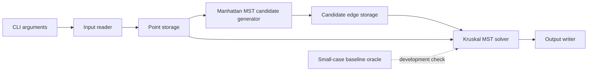

# High-Level Design

## Overview

This design defines a Linux C++ command-line solver for NYCU PDA Programming Assignment #4. The program reads up to 10,000,000 2D integer points, computes only the total Rectilinear Minimum Spanning Tree (RMST) weight under Manhattan distance, and writes that integer to an output file.

The architecture is a single-process batch pipeline:



The production path must avoid complete-graph construction. It generates a sparse set of candidate edges using Manhattan MST geometric transformations and directional sweeps, then runs Kruskal's algorithm over those candidates using a disjoint-set union structure.

Sources: `doc/proposal.md` Objective, Problem Summary, Proposed Approach, Algorithm Strategy; `doc/problem-brief.md` Assignment Objective and Constraints; `p4_routing.pdf` Sections 1-7.

## Goals

- Compute the total RMST weight under Manhattan distance.
- Support the assignment input format: first line `n`, followed by `n` coordinate pairs.
- Support the assignment CLI shape: `[executable] [input file] [output file]`.
- Write only one integer, the total RMST weight, to the output file.
- Use signed 64-bit integers for distances, edge weights, and the final total.
- Avoid O(n^2) complete-graph construction in the production path.
- Scale toward `n <= 10,000,000` with explicit, contiguous memory usage.
- Provide the required submission artifacts: source code, `Makefile`, and `readme.txt`.
- Include a minimal correctness path using the PDF sample and small-case baseline comparisons during development.

Sources: `doc/proposal.md` Objective, Constraints, Proposed Approach, Validation Plan; `doc/problem-brief.md` Confirmed Facts; `p4_routing.pdf` Sections 1-7.

## Non-Goals

- Constructing or storing the complete graph for production inputs.
- Producing the full RMST edge list; only the total weight is required.
- Adding third-party libraries without later user approval.
- Building a general-purpose geometry framework beyond this assignment.
- Adding CI, packaging automation, or broad test infrastructure before source files define the needed commands.
- Defining the final student-ID tar packaging before the student ID is known.

Sources: `doc/proposal.md` Alternatives Considered, Assumptions, Open Questions; `doc/quality-gates.md` Missing Quality Gates; `doc/problem-brief.md` Required Outputs.

## Requirements Summary

| Area | Requirement | Source |
| --- | --- | --- |
| Input | First line `n`; next `n` lines contain integer `x y` coordinates. | `p4_routing.pdf` Section 2; `doc/problem-brief.md` Required Inputs |
| Size | `1 <= n <= 10,000,000`. | `p4_routing.pdf` Section 2 |
| Coordinates | `-10^9 <= x, y <= 10^9`; duplicate coordinates are allowed. | `p4_routing.pdf` Section 2 |
| Metric | Manhattan distance: `|xi - xj| + |yi - yj|`. | `p4_routing.pdf` Section 1 |
| Output | One integer: total RMST weight only. | `p4_routing.pdf` Section 3 |
| CLI | `[executable] [input file] [output file]`, e.g. `RMST input.dat output.dat`. | `p4_routing.pdf` Section 5 |
| Platform | Linux. | `p4_routing.pdf` Section 4 |
| Language | C or C++ preferred; proposal chooses C++. | `p4_routing.pdf` Section 4; `doc/proposal.md` Proposed Approach |
| Performance | Avoid O(n^2); each case fails if runtime exceeds 1 hour. | `p4_routing.pdf` Sections 1 and 7 |
| Arithmetic | Distances and final weight must use signed 64-bit integers. | `p4_routing.pdf` Section 1 |
| Deliverables | Source code, `Makefile`, `readme.txt`. | `p4_routing.pdf` Section 6 |

## Proposed Architecture

The solver is organized as a compact batch pipeline inside a C++ program. File-level splitting is not fixed by this HLD; the proposal permits a single `main.cpp`, and that remains the simplest compatible implementation unless later complexity justifies more files.

The production algorithm has four major phases:

1. Parse command-line arguments and read all input points into contiguous storage.
2. Generate sparse RMST candidate edges using standard Manhattan-distance transformations and directional sweeps.
3. Sort candidate edges by weight and run Kruskal's algorithm with disjoint-set union.
4. Write only the 64-bit RMST total to the requested output file.

A small-case baseline MST path may exist for development validation. It may build all pairwise edges only for tiny inputs used as a correctness oracle, and it must not be used for large production inputs.

Sources: `doc/proposal.md` Proposed Approach, Algorithm Strategy, Performance Strategy, Module Candidates.

## Modules

| Module | Responsibility | Inputs | Outputs | Owned Data | Dependencies | Externally Visible Behavior | Source Traceability |
| --- | --- | --- | --- | --- | --- | --- | --- |
| CLI and Orchestrator | Validate assignment-style arguments and sequence the solver pipeline. | `argv` with input and output file paths. | Exit status; calls into reader, solver, writer. | None beyond transient paths/status. | Input Reader, RMST Solver, Output Writer. | Program accepts `[executable] [input file] [output file]`. | `p4_routing.pdf` Section 5; `doc/proposal.md` Module Candidates |
| Input Reader | Read `n` and coordinate pairs efficiently from file. | Input file path. | Contiguous point list. | Parsed point count and point coordinates. | CLI and Point Storage. | Rejects or fails on unreadable input; exact malformed-input behavior remains open. | `p4_routing.pdf` Section 2; `doc/proposal.md` Proposed Approach |
| Point Storage | Hold coordinates and stable point identifiers needed by sweeps and Kruskal. | Parsed coordinate pairs. | Indexed points for candidate generation and MST solving. | Coordinates and original/working point ids. | Input Reader, Candidate Generator. | Not directly visible outside program. | `doc/proposal.md` Performance Strategy |
| Manhattan MST Candidate Generator | Produce a sparse candidate edge set that preserves the RMST under Manhattan distance. | Point storage. | Candidate edges with endpoint ids and 64-bit weights. | Transformed/sorted views and sweep state. | Point Storage, Edge Storage. | Not directly visible; affects computed total. | `doc/proposal.md` Intended optimized method |
| Edge Storage | Store candidate edges compactly for Kruskal. | Generated candidate edges. | Sortable edge list. | Endpoint ids and 64-bit weights. | Candidate Generator, Kruskal Solver. | Not directly visible. | `doc/proposal.md` Compact point, edge, and disjoint-set storage |
| Disjoint-Set Union | Track connected components during Kruskal. | Point count; edge endpoints. | Component merge decisions. | Parent and rank/size arrays. | Kruskal Solver. | Not directly visible. | `doc/proposal.md` Proposed Approach and Performance Strategy |
| Kruskal MST Solver | Sort candidate edges and accumulate the RMST total. | Candidate edge list; point count. | Signed 64-bit total weight. | Edge ordering state; DSU instance; running total. | Edge Storage, DSU. | Determines the output integer. | `doc/proposal.md` Algorithm Strategy |
| Output Writer | Write the final answer to the output file. | Output file path; 64-bit total. | Output file containing one integer. | None beyond output stream state. | CLI and Kruskal Solver. | File contains only the total RMST weight. | `p4_routing.pdf` Section 3; `doc/problem-brief.md` Required Outputs |
| Small-Case Baseline Oracle | Build a complete graph only for tiny local tests and compare against optimized results. | Small generated or sample point sets. | Expected MST total for validation. | Temporary complete edge list for tiny cases only. | Distance helper, Kruskal/DSU or equivalent baseline MST. | Development/test-only behavior; not part of large production path. | `doc/proposal.md` Baseline method and Correctness strategy |
| Build and Submission Artifacts | Provide build and usage instructions required by the assignment. | Source files and compiler. | Executable, `readme.txt`, optional smoke-check data. | `Makefile` rules and documentation text. | Source module names chosen during implementation. | User can build and run the solver on Linux. | `p4_routing.pdf` Section 6; `doc/quality-gates.md` Recommended Minimum Done Criteria |

## Module Relationships

| Type | Source | Target | Confirmed Source Fact or Open | Direction and Ownership | Data or Contract |
| --- | --- | --- | --- | --- | --- |
| Lifecycle order | CLI and Orchestrator | Input Reader | Confirmed by assignment CLI and proposal pipeline. | CLI owns sequencing. | Input file path. |
| Data flow | Input Reader | Point Storage | Confirmed by input format and large-scale storage need. | Reader produces; storage owns. | `n`, coordinates, point ids. |
| Data flow | Point Storage | Candidate Generator | Confirmed by optimized Manhattan MST plan. | Candidate generator reads point data. | Indexed points and transformed coordinate views. |
| Data flow | Candidate Generator | Edge Storage | Confirmed by sparse candidate-edge approach. | Generator produces; edge storage owns. | Endpoint ids and 64-bit weights. |
| Call | Kruskal MST Solver | Disjoint-Set Union | Confirmed by proposal use of Kruskal with DSU. | Kruskal owns DSU lifecycle. | `find` and `union` operations. |
| Data flow | Edge Storage | Kruskal MST Solver | Confirmed by Kruskal over generated candidates. | Kruskal consumes sortable edge list. | Candidate edges sorted by weight. |
| Data flow | Kruskal MST Solver | Output Writer | Confirmed by output requirement. | Solver produces; writer serializes. | One signed 64-bit total. |
| Evaluator/test dependency | Small-Case Baseline Oracle | Candidate Generator and Kruskal MST Solver | Confirmed by validation plan. | Test path compares optimized solver against baseline. | Tiny complete-graph MST totals only. |
| Configuration dependency | Build and Submission Artifacts | CLI and Orchestrator | Open: executable name and C++ standard are not confirmed. | `Makefile` will define executable and compiler flags during implementation. | Required build/run commands. |

## Data Flow

1. The executable receives exactly the input file path and output file path from command-line arguments.
2. The input reader parses `n` and the next `n` coordinate pairs.
3. Points are stored in contiguous arrays or vectors suitable for repeated sorting/sweep access.
4. The candidate generator applies Manhattan MST transformations and directional sweeps to create a sparse edge set.
5. Each candidate edge stores two point identifiers and a signed 64-bit Manhattan distance.
6. Kruskal's algorithm sorts candidate edges by weight, uses DSU to accept component-connecting edges, and accumulates the total in a signed 64-bit integer.
7. The output writer writes only the total weight to the requested output file.

For development checks, tiny point sets may also flow through the baseline oracle, which builds complete pairwise edges only when the input size is intentionally small.

Sources: `doc/proposal.md` Algorithm Strategy, Correctness Strategy, Performance Strategy; `doc/problem-brief.md` Required Inputs and Outputs.

## Interfaces and Contracts

### Command-Line Interface

Contract: `[executable] [input file] [output file]`.

The assignment example uses `RMST input.dat output.dat`. The exact executable name is still open, but the interface shape is confirmed.

### Input File

```text
n
x1 y1
x2 y2
...
xn yn
```

Coordinates are signed integers in `[-10^9, 10^9]`. Duplicate coordinate pairs are valid.

### Output File

```text
total_weight
```

The file must contain only the RMST total weight. The sample case total is `13`.

### Internal Data Contracts

- Point identifiers must be stable across transformed views, candidate generation, and DSU.
- Edge weights and accumulated totals must be signed 64-bit integers.
- The production candidate edge set must remain sparse and must be sufficient for Kruskal to recover the RMST.
- Baseline complete-graph data is allowed only for tiny local validation cases.

Sources: `p4_routing.pdf` Sections 2, 3, and 5; `doc/proposal.md` Validation Plan and Performance Strategy.

## Operational Considerations

- Runtime: grading fails a test case if execution exceeds 1 hour.
- Memory: no explicit memory limit is provided, but `n = 10,000,000` requires contiguous, bounded data structures and avoidance of per-point heap allocations in hot paths.
- Sorting cost: sorting points and candidate edges is expected to dominate runtime.
- Duplicate points: duplicate coordinates can produce zero-weight connections; the design must preserve the same RMST total.
- File I/O: input and output should use fast file-based I/O rather than interactive stdin/stdout assumptions.
- Build: no build command exists yet; the future `Makefile` is the repository-defined build entry point.

Sources: `p4_routing.pdf` Sections 1 and 7; `doc/proposal.md` Performance Strategy, Risks and Tradeoffs; `doc/quality-gates.md` Build Commands.

## Testing and Quality Gate Alignment

Current quality gates are missing because there are no source files, build files, tests, or scripts yet.

Minimum future quality alignment:

- Add a `Makefile` and verify the build command succeeds.
- Run the PDF sample:

```text
input:
5
0 0
2 0
2 3
5 1
6 4

expected output:
13
```

- Compare optimized results against the small-case baseline oracle for deterministic and randomized tiny inputs.
- Include edge cases for `n = 1`, duplicate points, negative coordinates, same `x`, same `y`, and repeated coordinate values.
- Verify the production path does not build the complete graph.
- Verify output files contain only one integer.
- Verify all distances and the final answer use signed 64-bit arithmetic.

Sources: `doc/quality-gates.md` Recommended Minimum Done Criteria; `doc/proposal.md` Validation Plan.

## Risks and Tradeoffs

| Risk or Tradeoff | Impact | Mitigation |
| --- | --- | --- |
| Candidate generator correctness | Missing a required candidate edge can produce a wrong MST total. | Validate against brute-force baseline on many small cases and keep the candidate theorem traceable in detailed design. |
| Memory pressure at 10,000,000 points | Excess copies or oversized edge storage can exceed practical memory. | Use contiguous compact structs, reuse transformed views where possible, and keep candidate count near linear. |
| Sorting cost | Sorting dominates runtime on large inputs. | Minimize copied fields and avoid unnecessary sort passes beyond the selected Manhattan MST method. |
| Duplicate coordinates | Mishandling duplicates can lose zero-weight connectivity or bloat candidates. | Treat duplicates explicitly in detailed design while preserving the same RMST total. |
| Unknown compiler and memory limit | Build flags and memory budget cannot be finalized. | Keep implementation standard-library-only and document chosen compiler defaults in `Makefile`/`readme.txt`. |
| Baseline oracle misuse | Complete graph does not scale. | Gate it to tiny development tests only, separate from normal large-input execution. |

Sources: `doc/proposal.md` Risks and Tradeoffs; `doc/problem-brief.md` Open Questions.

## Assumptions

- C++ will be used because it is allowed by the PDF and selected by the proposal.
- The implementation will use only the C++ standard library unless the user later approves external dependencies.
- Assignment artifacts will live in the repository root unless a later convention is documented.
- The executable name can be chosen during implementation unless the user requires exactly `RMST`.
- Exact duplicate coordinates may be handled by any method that preserves the same RMST total.
- Remaining malformed-input behavior can be simple and grading-oriented unless stricter behavior is requested.
- Conceptual modules in this HLD do not require separate source files; a single `main.cpp` remains acceptable if it stays readable.

Sources: `doc/proposal.md` Assumptions and Module Candidates; `AGENTS.md` Repository Rules and Coding Rules.

## Open Questions

- What student ID should be used for final folder and tar names?
- Should the executable be named exactly `RMST`?
- What C++ standard and compiler should the `Makefile` target?
- Is there a memory limit beyond the 1-hour runtime limit?
- Are third-party libraries disallowed, or merely unnecessary?
- How strict should error handling be for malformed input or missing command-line arguments?
- Are duplicate points expected to be treated as separate vertices connected by zero-weight edges, or can exact duplicate coordinates be deduplicated if the RMST total is unchanged?
